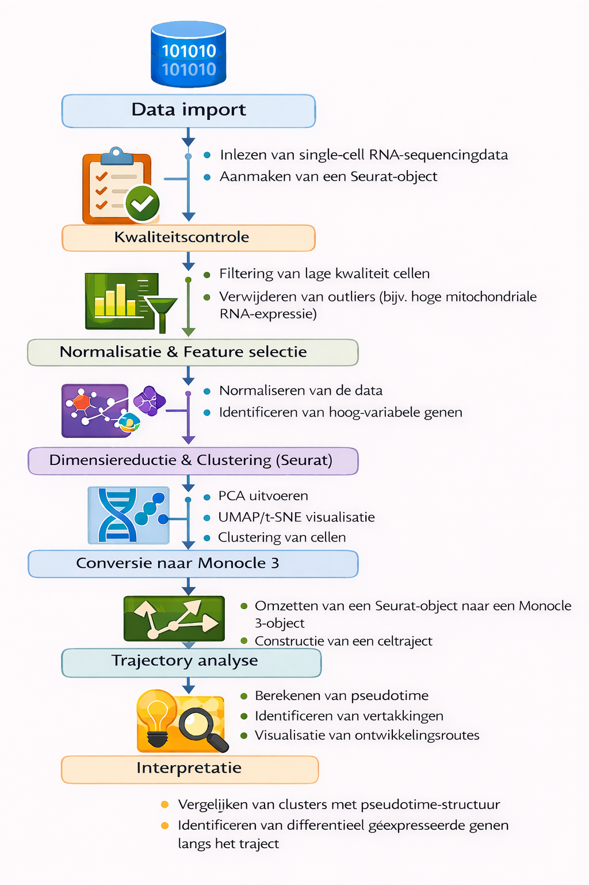

# Data science project: Reconstructie van celontwikkelingsroutes in muizenembryo's

Dit project richt zich op het reconstrueren van ontwikkelingsroutes (*trajectory-analyse*) in muizenembryo’s op basis van single-cell RNA-sequencingdata. Met behulp van Seurat en Monocle3 worden celclusters geïdentificeerd en geordend langs pseudotime om ontwikkelingsdynamiek inzichtelijk te maken.

Dit project valt onder de voorwaarden van de MIT-licentie.

------------------------------------------------------------------------

## Beschrijving

Tijdens de embryonale ontwikkeling ondergaan cellen complexe differentiatieprocessen waarbij zij zich ontwikkelen tot gespecialiseerde celtypen. Om deze processen beter te begrijpen, wordt in dit project gebruikgemaakt van single-cell RNA-sequencingdata afkomstig van muizenembryo’s op embryonale dagen E6.5, E7.5, E8.5 en E9.5.

De dataset is gegenereerd met VASA-seq, een methode die het totale RNA-profiel van individuele cellen vastlegt. Hierdoor kan een completer beeld worden verkregen van genexpressie tijdens vroege ontwikkeling.

De analyse wordt uitgevoerd in R met behulp van:

-   **Seurat** voor data preprocessing, normalisatie en clustering

-   **Monocle3** voor trajectory-analyse en reconstructie van pseudotime

Het doel is om ontwikkelingsroutes te identificeren en te onderzoeken hoe de in Seurat gevonden clusters zich verhouden tot de trajectstructuur die met Monocle3 wordt gereconstrueerd.

In deze githup repository zullen alle scripts en data worden opgeslagen. Niet alle data wordt op deze githup opgeslagen in verband met de grootte van deze bestanden, in de .gitignore file zijn de mappen te vinden die niet op github worden opgeslagen.

------------------------------------------------------------------------

## Workflow

De workflow van dit project bestaat uit de volgende stappen.

### 

## Deelvragen

Deelvraag 1: Hoe kan de kwaliteit van de VASA-seq single-cell data worden beoordeeld?

Deelvraag 2: Welke celpopulaties en clusters kunnen worden geïdentificeerd binnen de dataset via Seurat?

Deelvraag 3: Welke genen zijn karakteristiek voor de verschillende clusters?

Deelvraag 4: Hoe kunnen deze clusters worden geïntegreerd in een ontwikkelingscontinuüm met behulp van Monocle 3?

Deelvraag 5: Welke belangrijke ontwikkelingsroutes worden zichtbaar tussen E6.5 en E9.5?

Deelvraag 6: In hoeverre komen de Seurat-clusters overeen met de pseudotime-braches van Monocle 3?

Hoofdvraag: Welke ontwikkelingsroutes (pseudotime-trajecten) kunnen worden geïdentificeerd in muizenembryo’s tussen E6.5 en E9.5 op basis van single-cell RNA-sequencingdata, en hoe verhouden de in Seurat geïdentificeerde clusters zich tot de trajectstructuur die met Monocle 3 wordt gereconstrueerd?

------------------------------------------------------------------------

## Project structuur

``` ruby
install.packages("fs")
fs::dir_tree(path = ".", recurse = 1)
```

```         
data_integration
├── LICENSE
├── README.html
├── README.md
├── analyse
├── bewerkte_data
├── data_integration.Rproj
├── raw_data
│   ├── e65_count_matrix.csv
│   ├── e65_count_matrix.csv.gz
│   ├── e65_feature_metadata.csv
│   ├── e65_feature_metadata.csv.gz
│   ├── e65_sample_metadata.csv
│   ├── e75_count_matrix.csv.gz
│   ├── e75_feature_metadata.csv.gz
│   ├── e75_sample_metadata.csv
│   ├── e85_count_matrix.csv.gz
│   ├── e85_count_matrix.mtx.gz
│   ├── e85_feature_metadata.csv.gz
│   ├── e85_sample_metadata.csv
│   ├── e95_count_matrix.csv.gz
│   ├── e95_feature_metadata.csv.gz
│   ├── e95_sample_metadata.csv
│   └── pbmc3k_filtered_gene_bc_matrices.tar
└── scripts
    ├── 01_seurat_tutorial.Rmd
    ├── 01_seurat_tutorial.pdf
    ├── 02_seurat_data_integration_tutorial.Rmd
    ├── 02_seurat_data_integration_tutorial.pdf
    ├── 03_e6.5_data_omzetten_van_csv_naar_mtx.R
    ├── 04_e7.5_data_omzetten_van_csv_naar_mtx.R
    ├── 05_e8.5_data_omzetten_van_csv_naar_mtx.R
    ├── 06_e9.5_data_omzetten_van_csv_naar_mtx.R
    ├── 07_data_omzetten_van_csv_naar_mtx.R
    ├── 08_e6.5_data_laden.Rmd
    ├── 08_e6.5_data_laden.pdf
    ├── 09_e7.5_data_laden.Rmd
    ├── 10_monocle3_clusteren_tutorial.Rmd
    ├── 10_monocle3_clusteren_tutorial.pdf
    ├── 11_monocle3_clusteren_e6.5.Rmd
    ├── 12_monocle3_trajectories_tutorial.Rmd
    └── 12_monocle3_trajectories_tutorial.pdf
```

------------------------------------------------------------------------

## Setup

De volgende packages zijn gedurende het project gebruikt:

-   dplyr
-   Seurat
-   patchwork
-   here
-   SeuratData
-   ggplot2
-   cowplot
-   Matrix
-   monocle3
-   data.table

------------------------------------------------------------------------

## Originele data

De originele data komt uit het artikel: High-throughput total RNA sequencing in single cells using VASA-seq.

doi: <https://doi.org/10.1038/s41587-022-01361-8>

------------------------------------------------------------------------

## Contactgegevens

Bij vragen en opmerkingen kunt u terecht bij:

Naam: Petra Molenaar

e-mail: [petra.molenaar\@student.hu.nl](mailto:petra.molenaar@student.hu.nl)
