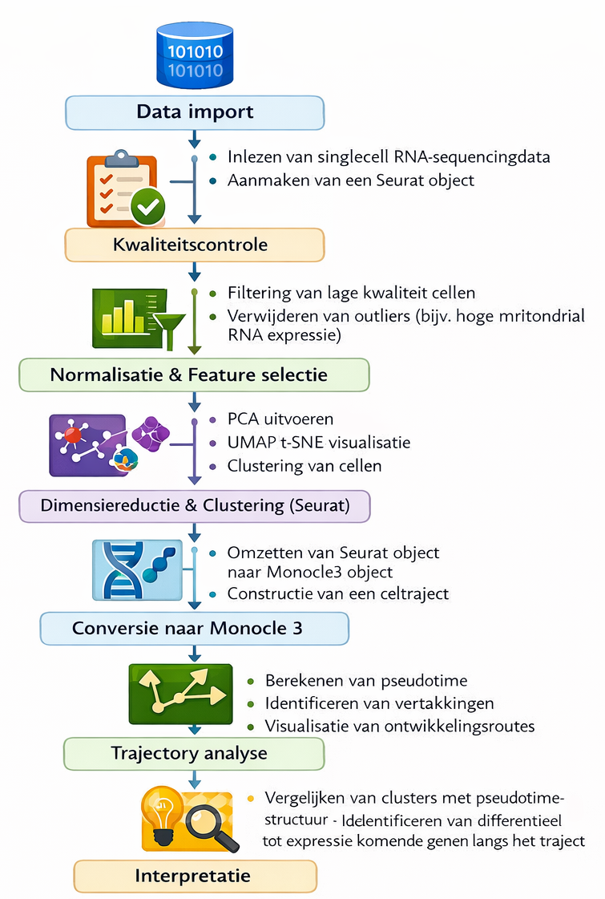

# Data science project: Reconstructie van celontwikkelingsroutes in muizenembryo's

Dit project richt zich op het reconstrueren van ontwikkelingsroutes (*trajectory-analyse*) in muizenembryo’s op basis van single-cell RNA-sequencingdata. Met behulp van Seurat en Monocle3 worden celclusters geïdentificeerd en geordend langs pseudotime om ontwikkelingsdynamiek inzichtelijk te maken.

Dit project valt onder de voorwaarden van de MIT-licentie.

------------------------------------------------------------------------

## Beschrijving

Tijdens de embryonale ontwikkeling ondergaan cellen complexe differentiatieprocessen waarbij zij zich ontwikkelen tot gespecialiseerde celtypen. Om deze processen beter te begrijpen, wordt in dit project gebruikgemaakt van single-cell RNA-sequencingdata afkomstig van muizenembryo’s op embryonale dagen E6.5, E7.5, E8.5 en E9.5.

De dataset is gegenereerd met VASA-seq, een methode die het totale RNA-profiel van individuele cellen vastlegt. Hierdoor kan een completer beeld worden verkregen van genexpressie tijdens vroege ontwikkeling.

De analyse wordt uitgevoerd in R met behulp van:

-   **Seurat** voor data preprocessing, normalisatie en clustering

-   **Monocle3** voor trajectory-analyse en reconstructie van pseudotime

Het doel is om ontwikkelingsroutes te identificeren en te onderzoeken hoe de in Seurat gevonden clusters zich verhouden tot de trajectstructuur die met Monocle3 wordt gereconstrueerd.

In deze githup repository zullen alle scripts en data worden opgeslagen. Niet alle data wordt op deze githup opgeslagen in verband met de grootte van deze bestanden, in de .gitignore file zijn de mappen te vinden die niet op github worden opgeslagen.

------------------------------------------------------------------------

## Workflow

De workflow van dit project bestaat uit de volgende stappen.



------------------------------------------------------------------------

## Deelvragen

Deelvraag 1: Hoe kan de kwaliteit van de VASA-seq single-cell data worden beoordeeld?

Deelvraag 2: Welke celpopulaties en clusters kunnen worden geïdentificeerd binnen de dataset via Seurat?

Deelvraag 3: Welke genen zijn karakteristiek voor de verschillende clusters?

Deelvraag 4: Hoe kunnen deze clusters worden geïntegreerd in een ontwikkelingscontinuüm met behulp van Monocle 3?

Deelvraag 5: Welke belangrijke ontwikkelingsroutes worden zichtbaar tussen E6.5 en E9.5?

Deelvraag 6: In hoeverre komen de Seurat-clusters overeen met de pseudotime-braches van Monocle 3?

Hoofdvraag: Welke ontwikkelingsroutes (pseudotime-trajecten) kunnen worden geïdentificeerd in muizenembryo’s tussen E6.5 en E9.5 op basis van single-cell RNA-sequencingdata, en hoe verhouden de in Seurat geïdentificeerde clusters zich tot de trajectstructuur die met Monocle 3 wordt gereconstrueerd?

------------------------------------------------------------------------

## Project structuur

``` ruby
install.packages("fs")
fs::dir_tree(path = ".", recurse = 1)
```

```         
├── LICENSE
├── README.html
├── README.md
├── analyse
│   └── marker_file.txt
├── bewerkte_data
│   ├── e65_count_matrix.mtx.gz
│   ├── e75_count_matrix.mtx.gz
│   ├── e85_count_matrix.mtx.gz
│   └── e95_count_matrix.mtx.gz
├── data_integration.Rproj
├── raw_data
│   ├── e65_count_matrix.csv
│   ├── e65_count_matrix.csv.gz
│   ├── e65_feature_metadata.csv
│   ├── e65_feature_metadata.csv.gz
│   ├── e65_sample_metadata.csv
│   ├── e75_count_matrix.csv.gz
│   ├── e75_feature_metadata.csv.gz
│   ├── e75_sample_metadata.csv
│   ├── e85_count_matrix.csv.gz
│   ├── e85_count_matrix.mtx.gz
│   ├── e85_feature_metadata.csv.gz
│   ├── e85_sample_metadata.csv
│   ├── e95_count_matrix.csv.gz
│   ├── e95_feature_metadata.csv.gz
│   ├── e95_sample_metadata.csv
│   └── filtered_gene_bc_matrices
└── scripts
    ├── 01_seurat_tutorial.Rmd
    ├── 01_seurat_tutorial.pdf
    ├── 02_seurat_data_integration_tutorial.Rmd
    ├── 02_seurat_data_integration_tutorial.pdf
    ├── 03_e6.5_data_omzetten_van_csv_naar_mtx.R
    ├── 04_e7.5_data_omzetten_van_csv_naar_mtx.R
    ├── 05_e8.5_data_omzetten_van_csv_naar_mtx.R
    ├── 06_e9.5_data_omzetten_van_csv_naar_mtx.R
    ├── 07_data_omzetten_van_csv_naar_mtx.R
    ├── 08_e6.5_data_laden.Rmd
    ├── 08_e6.5_data_laden.pdf
    ├── 09_e7.5_data_laden.Rmd
    ├── 09_e7.5_data_laden.pdf
    ├── 10_e8.5_data_laden.Rmd
    ├── 10_e8.5_data_laden.pdf
    ├── 11_monocle3_installeren.R
    ├── 12_monocle3_clusteren_tutorial.Rmd
    ├── 12_monocle3_clusteren_tutorial.pdf
    ├── 13_monocle3_trajectories_tutorial.Rmd
    ├── 13_monocle3_trajectories_tutorial.pdf
    ├── 14_monocle3_clusteren_en_trajectanalyse_e6.5.Rmd
    ├── 14_monocle3_clusteren_en_trajectanalyse_e6.5.pdf
    ├── 15_monocle3_clusteren_en_trajectanalyse_e7.5.Rmd
    ├── 15_monocle3_clusteren_en_trajectanalyse_e7.5.pdf
    ├── 16_monocle3_clusteren_en_trajectanalyse_e6.5_en_e7.5.Rmd
    └── 16_monocle3_clusteren_en_trajectanalyse_e6.5_en_e7.5.pdf
```

------------------------------------------------------------------------

## Uitleg van bestanden en uitvoervolgorde

Dit project bestaat uit een reeks scripts die samen een complete analysepipeline vormen voor het reconstrueren van ontwikkelingsroutes in muizenembryo’s. De analyse verloopt stapsgewijs, waarbij de output van een script vaak dient als input voor een volgend script. Daarom is het belangrijk dat de bestanden in de juiste volgorde worden uitgevoerd.

De workflow begint met een introductie in Seurat via het bestand `01_seurat_tutorial.Rmd`. Dit script dient als voorbereiding op de analyse en laat zien hoe single-cell data kan worden ingelezen, gefilterd en geclusterd. Het bestand `02_seurat_data_integration_tutorial.Rmd` is eveneens opgenomen in de repository, maar speelt geen rol in de uiteindelijke analysepipeline. Dit script is toegevoegd omdat in een vroeg stadium van het project het plan bestond om data-integratie met Seurat toe te passen. Uiteindelijk is ervoor gekozen om over te stappen naar Monocle3 voor de verdere analyse, waardoor dit onderdeel niet meer wordt gebruikt.

De daadwerkelijke pipeline begint met het omzetten van de ruwe data. De bestanden `03_e6.5_data_omzetten_van_csv_naar_mtx.R` tot en met `06_e9.5_data_omzetten_van_csv_naar_mtx.R` maken het mogelijk om **per embryonaal tijdspunt afzonderlijk** de data om te zetten van CSV naar MTX-formaat. Dit is handig wanneer je slechts één specifiek tijdspunt wilt analyseren. Het script `07_data_omzetten_van_csv_naar_mtx.R` biedt daarnaast de mogelijkheid om **alle tijdspunten in één keer** te converteren. Het MTX-formaat is efficiënter voor opslag en verwerking en vormt de basis voor de verdere analyse. Zonder deze geconverteerde bestanden kunnen de volgende scripts niet worden uitgevoerd.

Na de conversie wordt de data ingelezen en voorbewerkt met Seurat. Dit gebeurt in de bestanden `08_e6.5_data_laden.Rmd`, `09_e7.5_data_laden.Rmd` en `10_e8.5_data_laden.Rmd`. In deze scripts worden de datasets per embryonale dag geladen, gecontroleerd op kwaliteit, genormaliseerd en geclusterd. Het resultaat van deze stap zijn Seurat-objecten die inzicht geven in de verschillende celpopulaties binnen de dataset.

Voordat de trajectory-analyse kan worden uitgevoerd, moet het package Monocle3 geïnstalleerd worden. Dit gebeurt in `11_monocle3_installeren.R`. Daarnaast zijn er twee tutorialbestanden (`12_monocle3_clusteren_tutorial.Rmd` en `13_monocle3_trajectories_tutorial.Rmd`) die extra uitleg geven over de werking van Monocle3 en pseudotime-analyse. Deze zijn bedoeld ter ondersteuning, maar zijn niet noodzakelijk voor het uitvoeren van de pipeline.

De kern van de trajectory-analyse vindt plaats in de daaropvolgende scripts. In `14_monocle3_clusteren_en_trajectanalyse_e6.5.Rmd` en `15_monocle3_clusteren_en_trajectanalyse_e7.5.Rmd` wordt de analyse volledig uitgevoerd binnen Monocle3. In deze stap worden cellen geclusterd en geordend langs een pseudotime-as, waarmee ontwikkelingsroutes worden gereconstrueerd en inzicht ontstaat in de dynamiek van celontwikkeling.

Tot slot wordt in `16_monocle3_clusteren_en_trajectanalyse_e6.5_en_e7.5.Rmd` een gecombineerde analyse uitgevoerd waarin meerdere datasets samen worden bekeken. Hierdoor kunnen bredere ontwikkelingspatronen en trajectstructuren worden geïdentificeerd die niet zichtbaar zijn binnen afzonderlijke datasets.

Samengevat vormt dit project één doorlopende analysepipeline waarin ruwe single-cell RNA-sequencingdata eerst wordt voorbereid en geanalyseerd met Seurat, waarna Monocle3 wordt gebruikt om ontwikkelingsroutes en pseudotime-trajecten te reconstrueren. Het is essentieel om de scripts in de juiste volgorde uit te voeren, omdat latere stappen afhankelijk zijn van eerder gegenereerde output.

------------------------------------------------------------------------

## Setup

De volgende packages zijn gedurende het project gebruikt:

-   dplyr
-   Seurat
-   patchwork
-   here
-   SeuratData
-   ggplot2
-   cowplot
-   Matrix
-   monocle3
-   data.table

------------------------------------------------------------------------

## Originele data

De originele data komt uit het artikel: High-throughput total RNA sequencing in single cells using VASA-seq.

doi: <https://doi.org/10.1038/s41587-022-01361-8>

------------------------------------------------------------------------

## Contactgegevens

Bij vragen en opmerkingen kunt u terecht bij:

Naam: Petra Molenaar

e-mail: [petra.molenaar\@student.hu.nl](mailto:petra.molenaar@student.hu.nl)
